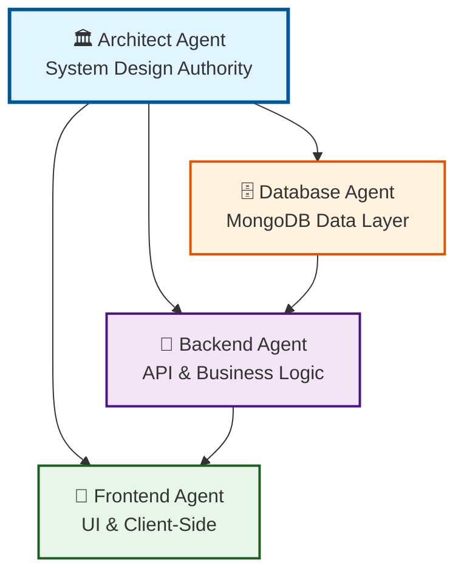
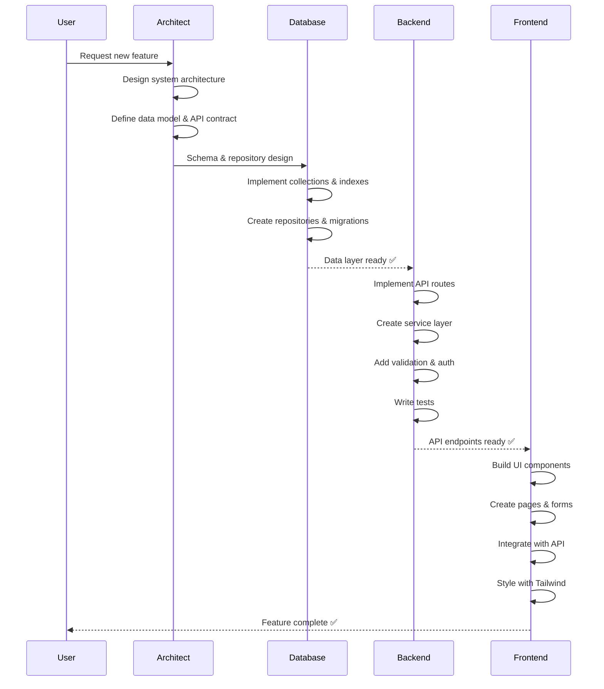
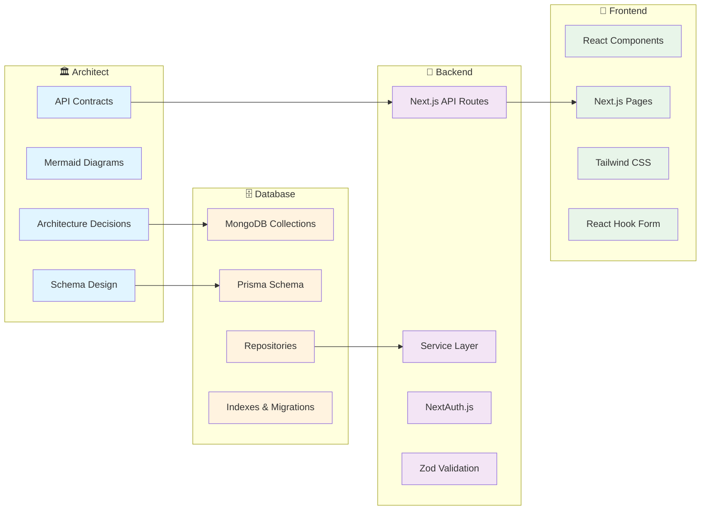

# 🏗️ Agent Architecture — Visual Guide

## Agent Hierarchy



## Feature Development Flow



## Technology Stack Mapping



## Responsibility Matrix

| Task | Architect | Database | Backend | Frontend |
|------|-----------|----------|---------|----------|
| **Design Phase** |
| System architecture | ✅ | ❌ | ❌ | ❌ |
| Data model design | ✅ | 🤝 | ❌ | ❌ |
| API contracts | ✅ | ❌ | 🤝 | ❌ |
| Sequence diagrams | ✅ | ❌ | ❌ | ❌ |
| **Database Layer** |
| MongoDB schema | ❌ | ✅ | ❌ | ❌ |
| Indexes | ❌ | ✅ | ❌ | ❌ |
| Repositories | ❌ | ✅ | ❌ | ❌ |
| Migrations | ❌ | ✅ | ❌ | ❌ |
| Transactions | ❌ | ✅ | 🤝 | ❌ |
| **Backend Layer** |
| API routes | ❌ | ❌ | ✅ | ❌ |
| Business logic | ❌ | ❌ | ✅ | ❌ |
| Auth & authz | ❌ | ❌ | ✅ | ❌ |
| Validation schemas | ❌ | ❌ | ✅ | ❌ |
| Backend tests | ❌ | ❌ | ✅ | ❌ |
| **Frontend Layer** |
| UI components | ❌ | ❌ | ❌ | ✅ |
| Pages & layouts | ❌ | ❌ | ❌ | ✅ |
| Forms | ❌ | ❌ | ❌ | ✅ |
| Styling | ❌ | ❌ | ❌ | ✅ |
| Client-side logic | ❌ | ❌ | ❌ | ✅ |

**Legend:**
- ✅ Primary responsibility
- 🤝 Collaborative responsibility
- ❌ Not responsible

## File Organization by Agent

```
Gen-AI-Kata/
├── .github/agents/          # Agent definitions
│   ├── architect.md         # 🏛️
│   ├── database.agent.md    # 🗄️
│   ├── backend.agent.md     # 🔧
│   ├── frontend.agent.md    # 🎨
│   └── README.md
│
├── prisma/
│   ├── schema.prisma        # 🗄️ Database
│   └── seed.ts              # 🗄️ Database
│
├── src/
│   ├── app/
│   │   ├── api/             # 🔧 Backend
│   │   │   └── **/route.ts
│   │   ├── dashboard/       # 🎨 Frontend
│   │   │   ├── admin/
│   │   │   └── employee/
│   │   ├── layout.tsx       # 🎨 Frontend
│   │   └── page.tsx         # 🎨 Frontend
│   │
│   ├── components/          # 🎨 Frontend
│   │   ├── ui/
│   │   ├── forms/
│   │   └── features/
│   │
│   ├── lib/
│   │   ├── db/              # 🗄️ Database
│   │   │   ├── client.ts
│   │   │   └── repositories/
│   │   ├── services/        # 🔧 Backend
│   │   ├── auth.ts          # 🔧 Backend
│   │   ├── validators.ts    # 🔧 Backend
│   │   ├── types.ts         # 🔧 Backend + 🗄️ Database
│   │   └── constants.ts     # 🔧 Backend
│   │
│   ├── hooks/               # 🎨 Frontend
│   └── middleware.ts        # 🔧 Backend
│
├── __tests__/               # 🔧 Backend + 🎨 Frontend
└── docs/                    # 🏛️ Architect
```

## Common Workflows

### 1. New Feature (Full Stack)

```bash
Step 1: @architect design [feature] with data model and API contract
Step 2: @database implement collections and repositories
Step 3: @backend implement API routes and services
Step 4: @frontend build UI pages and components
```

### 2. Database Schema Change

```bash
Step 1: @architect review schema change impact
Step 2: @database plan migration for [change]
Step 3: @database implement migration script
Step 4: @backend update services to use new schema
Step 5: @frontend update components if needed
```

### 3. New API Endpoint

```bash
Step 1: @architect define API contract for [endpoint]
Step 2: @backend implement api [resource]
Step 3: @backend add validation and tests
Step 4: @frontend integrate with new endpoint
```

### 4. UI Enhancement

```bash
Step 1: @architect review if API changes needed
Step 2: @frontend implement component [name]
Step 3: @frontend style with Tailwind
Step 4: @frontend test responsive behavior
```

---

**Quick Reference Card**

| Need | Agent | Command Example |
|------|-------|-----------------|
| System design | 🏛️ | `@architect design approval workflow` |
| Database work | 🗄️ | `@database add indexes for requests` |
| API endpoint | 🔧 | `@backend implement api requests` |
| UI component | 🎨 | `@frontend create request form` |
| Diagram | 🏛️ | `@architect sequence diagram for login` |
| Migration | 🗄️ | `@database migration add field` |
| Auth/Security | 🔧 | `@backend harden auth` |
| Styling | 🎨 | `@frontend style navbar` |
