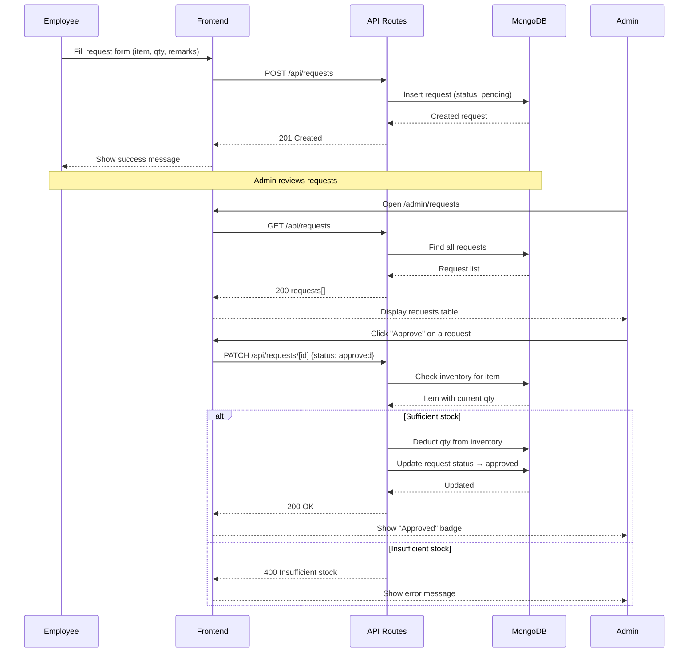

# Office Supply Management System — Project Blueprint

## 1. Project Overview

A lightweight web application for managing office supply requests. Employees submit requests for supplies; Admins review inventory and approve/reject those requests. Approved requests automatically deduct from inventory.

**Goal:** Working demo in a hackathon timeframe with clean UI and core CRUD workflows.

---

## 2. MVP Scope

| In Scope | Out of Scope |
|----------|-------------|
| Employee request submission form | Email/SMS notifications |
| Admin inventory view | Complex RBAC / OAuth |
| Admin approve/reject workflow | Reporting & analytics |
| Inventory auto-deduction on approval | File uploads / attachments |
| Request history with status | Audit logs beyond request history |
| Simple role-based routing (Admin/Employee) | Multi-tenant / org support |

---

## 3. Tech Stack

| Layer | Technology |
|-------|-----------|
| Frontend | Next.js 14+ (App Router), React, Tailwind CSS |
| Backend | Next.js Route Handlers (API routes) |
| Database | MongoDB Atlas + Mongoose |
| Auth (optional) | Simple role flag via cookie/localStorage; upgrade to NextAuth later |
| Deployment | Vercel (recommended) |

---

## 4. Folder Structure

```
/
├── app/
│   ├── layout.tsx                  # Root layout with nav
│   ├── page.tsx                    # Landing / role selector
│   ├── employee/
│   │   ├── page.tsx                # Employee dashboard (my requests)
│   │   └── new-request/
│   │       └── page.tsx            # New supply request form
│   ├── admin/
│   │   ├── page.tsx                # Admin dashboard
│   │   ├── inventory/
│   │   │   └── page.tsx            # View / manage inventory
│   │   └── requests/
│   │       └── page.tsx            # View & approve/reject requests
│   └── api/
│       ├── requests/
│       │   ├── route.ts            # GET all, POST new request
│       │   └── [id]/
│       │       └── route.ts        # PATCH approve/reject
│       └── inventory/
│           ├── route.ts            # GET all, POST add item
│           └── [id]/
│               └── route.ts        # PATCH update stock
├── components/
│   ├── Navbar.tsx
│   ├── RequestForm.tsx
│   ├── RequestTable.tsx
│   ├── InventoryTable.tsx
│   └── StatusBadge.tsx
├── lib/
│   ├── db.ts                       # Mongoose connection singleton
│   └── models/
│       ├── Request.ts
│       └── InventoryItem.ts
├── public/
├── tailwind.config.ts
├── package.json
└── .env.local                      # MONGODB_URI
```

---

## 5. Pages & Components

### Pages

| Route | Role | Purpose |
|-------|------|---------|
| `/` | All | Role selector (Admin / Employee) |
| `/employee` | Employee | List my submitted requests |
| `/employee/new-request` | Employee | Submit a new supply request |
| `/admin` | Admin | Dashboard overview |
| `/admin/inventory` | Admin | View current inventory |
| `/admin/requests` | Admin | View all requests, approve/reject |

### Components

| Component | Props | Description |
|-----------|-------|-------------|
| `Navbar` | role | Top nav with role-aware links |
| `RequestForm` | onSubmit | Item name, quantity, remarks fields |
| `RequestTable` | requests, onAction? | Tabular list with status badges; optional action buttons for admin |
| `InventoryTable` | items | Inventory list with name, quantity |
| `StatusBadge` | status | Colored pill: Pending / Approved / Rejected |

---

## 6. Data Models

### InventoryItem

```
{
  _id: ObjectId,
  name: String (required, unique),
  quantity: Number (required, min 0),
  createdAt: Date,
  updatedAt: Date
}
```

### Request

```
{
  _id: ObjectId,
  itemName: String (required),
  quantity: Number (required, min 1),
  remarks: String (optional),
  status: String (enum: "pending" | "approved" | "rejected", default "pending"),
  rejectionReason: String (optional),
  requestedBy: String (default "employee"),
  createdAt: Date,
  updatedAt: Date
}
```

---

## 7. API Routes

| Method | Endpoint | Description |
|--------|----------|-------------|
| GET | `/api/requests` | List all requests (optionally filter by status) |
| POST | `/api/requests` | Create a new supply request |
| PATCH | `/api/requests/[id]` | Approve or reject a request |
| GET | `/api/inventory` | List all inventory items |
| POST | `/api/inventory` | Add a new inventory item (admin seed) |
| PATCH | `/api/inventory/[id]` | Update item quantity |

### Request/Response Examples

**POST /api/requests**
```json
{ "itemName": "Whiteboard Marker", "quantity": 5, "remarks": "For meeting room B" }
→ 201 { request object }
```

**PATCH /api/requests/[id]**
```json
{ "status": "approved" }
→ 200 { updated request, inventory deducted }

{ "status": "rejected", "rejectionReason": "Out of stock" }
→ 200 { updated request }
```

---

## 8. Business Rules

1. A request is created with status `pending`.
2. Only Admin can change status to `approved` or `rejected`.
3. On **approval**: find the matching `InventoryItem` by name; deduct `request.quantity` from `item.quantity`. If insufficient stock, return 400 error.
4. On **rejection**: optionally store `rejectionReason`.
5. A request that is already approved/rejected cannot be changed again.
6. Inventory quantity must never go below 0.
7. Admin can view inventory but item seeding can be done via API/script.

---

## 9. Validations & Edge Cases

| Scenario | Handling |
|----------|----------|
| Empty item name or quantity ≤ 0 | Return 400 with validation error |
| Request for item not in inventory | Allow request creation; fail on approval with "Item not found" |
| Approve when stock < requested qty | Return 400 "Insufficient stock" |
| Double approve/reject | Return 400 "Request already processed" |
| Concurrent approvals draining stock | Use Mongoose `findOneAndUpdate` with `quantity >= deduction` filter |
| MongoDB connection failure | Return 500; use connection retry in `lib/db.ts` |

---

## 10. Development Phases

| Phase | Tasks | Time Est. |
|-------|-------|-----------|
| **Phase 1 — Setup** | Init Next.js + Tailwind, connect MongoDB, create Mongoose models | 30 min |
| **Phase 2 — API** | Build all 6 route handlers with validation | 45 min |
| **Phase 3 — Employee UI** | Request form, employee dashboard, request list | 45 min |
| **Phase 4 — Admin UI** | Inventory table, requests table with approve/reject buttons | 45 min |
| **Phase 5 — Integration** | Wire frontend to API, add error toasts, test flows end-to-end | 30 min |
| **Phase 6 — Polish** | Seed script, responsive tweaks, demo prep | 15 min |

**Total estimated: ~3.5 hours**

---

## 11. Sequence Diagram



---

## 12. Demo Flow

1. **Seed inventory** — Run seed script to add items (Markers, Notebooks, Pens, Sticky Notes).
2. **Employee submits request** — Navigate to `/employee/new-request`, submit "10 Markers".
3. **Employee views requests** — See pending request on `/employee`.
4. **Admin views inventory** — Navigate to `/admin/inventory`, see stock levels.
5. **Admin approves request** — Go to `/admin/requests`, approve the Markers request. Inventory drops by 10.
6. **Employee submits another** — Request "500 Notebooks" (exceeds stock).
7. **Admin rejects** — Reject with reason "Insufficient stock".
8. **Show history** — Both approved and rejected requests visible with status badges.

---

## 13. Handoff Notes

### Backend Agent
- Implement Mongoose models in `lib/models/` with timestamps enabled.
- Build route handlers in `app/api/` following the API table above.
- Use a singleton DB connection in `lib/db.ts` (cache on `globalThis` for dev hot-reload).
- Use atomic `findOneAndUpdate` with quantity guard for approval deductions.
- Return consistent JSON: `{ success: boolean, data?, error? }`.

### Frontend Agent
- Use Tailwind utility classes; no component library needed.
- All pages are client components (`"use client"`) except layouts.
- Use `fetch` for API calls; no external data-fetching library required.
- Role selection on `/` stores role in localStorage; `Navbar` reads it.
- Keep forms controlled with React `useState`.

### Integration Agent
- Wire each page to its corresponding API endpoint.
- Add loading states and basic error handling (alert or toast).
- Ensure the approve flow checks the API response before updating UI.
- Test the full Employee → Admin → Inventory deduction loop.

### Testing Agent
- Verify all 6 API endpoints with valid and invalid payloads.
- Test edge cases: duplicate approval, insufficient stock, missing fields.
- Confirm inventory decrements correctly after approval.
- Check that rejected requests retain `rejectionReason`.
- Verify UI shows correct status badges and error messages.

### Documentation Agent
- Write a `README.md` with setup instructions (`npm install`, `.env.local`, seed command).
- Document the API endpoints with sample curl commands.
- Add a screenshot or GIF of the demo flow.
- Include this blueprint as `docs/PROJECT_BLUEPRINT.md`.
